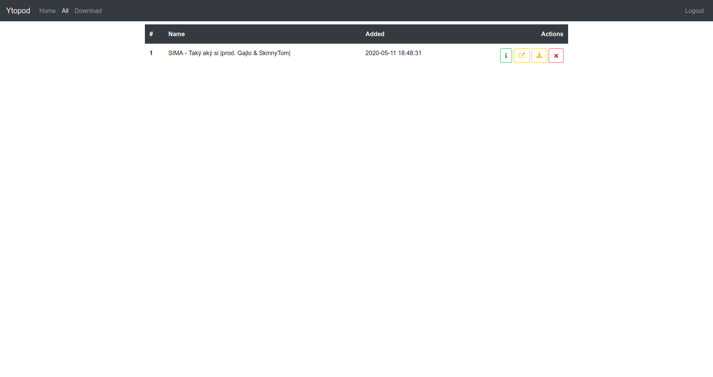

# Ytopod

Generating rss podcast feed from selected youtube videos.

This app allows you to download youtube videos, convert them to audio and add them to rss feed, which can be added to podcast player. It is meant for listening to conferences and similar videos, where audio is enough and podcast players have many useful features for consuming such content.

# Run

How to run ytopod

- install and setup docker
- install docker-compose
- in `flask` create `.env` file, you can copy it from `.env.sample`
- default setup file, you should change sqlite db path and secret key at least
- then build containers with `docker-compose build` in root of the project (where docker-compose.yml is located)
- to start container run `docker-compose up`
- to teardown container (deletes its content) run `docker-compose down`
- to stop ("pause", saves stuff) container run `docker-compose stop`
- to resume stopped container run `docker-compose start`
- on inital setup create default user (currently there is only single user mode)
- after downloading some videos, the feed is available on path `download/feed.xml`, it requires podcast player with http auth support

# Screenshots

# Todo

- [ ] more feeds
  - [ ] edit metadata about feed - name, filename(slug), picture, author
  - [ ] assign video to one feed
  - [ ] ordering per feed
  - [ ] allow to regenerate feed
- [x] auth
  - [x] login, protect almost all paths except home
  - [x] Add login mechanizms into UI, buttons, navigation filtering
    - [x] show simple navigation for unauthorized and rich navigation for logged in user
  - [x] first time register, if there is no user
  - [x] before first request check if any user exists, otherwise show first start
    - [x] on register path ~~redirect home~~ raise 404 if there is user already
  - [x] create http auth for podcast protection
- [ ] progress bar for videos being downloaded
  - [x] bootstrap progress bar on `all` site
  - [x] use socket io
  - [x] ~~allow user to close it, maybe cancel the download~~ autoreloads when all downloads are done
  - [ ] think about download cancel, but may be complicated
  - [x] auto ~~close~~ reload, ~~not sure~~
  - [ ] make socket connection only when previous site was from download, so it doesnt make useles socket connecitons on all `all` sites
    - [ ] or make separate page for viewing downloads and don't use `all` page
- [ ] Podcast episodes/videos
  - [ ] allow editing metadata
  - [ ] before download fetch metadata and allow user to change them, name, filename (slug), description, uploader then download
  - [ ] allow user to upload files
- [ ] Config and Settings
  - [ ] autoreload on download finish
- [ ] User management
  - [ ] Change password
  - [ ] Delete user
  - [ ] Create separate user/password for accessing podcasts/feeds
- [ ] Presentation
  - [ ] Create screenshots and gifs for github
  - [ ] Create instructions for running
  - [ ] Create About pages
- [ ] Setup
  - [ ] Move env file to root and add content trough docker-compose.yaml file